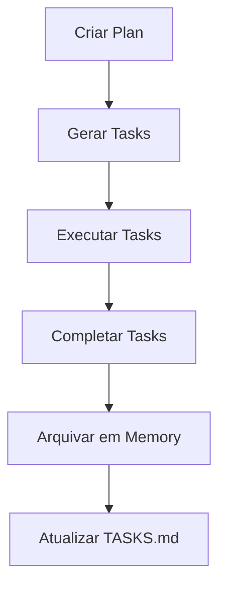

# Maestro Code - Gerenciador de Tarefas

## 📋 Visão Geral

**Maestro Code** é um sistema avançado de gerenciamento de projetos e tarefas baseado em arquivos Markdown. Desenvolvido para proporcionar controle total sobre o fluxo de desenvolvimento, desde o planejamento até a execução e arquivamento histórico.

## 🎯 Sistema Core - Task Magic

O **Maestro Code** utiliza o **Task Magic System** - uma metodologia revolucionária de gerenciamento baseada em arquivos, projetada para planejar funcionalidades, gerenciar tarefas de desenvolvimento e manter memória histórica completa do trabalho realizado.

### 🏗️ Componentes Principais

#### 1. **Plans** (`.ai/plans/`)
- **Propósito**: Documentos de Requisitos de Produto (PRDs) para funcionalidades
- **Estrutura**:
  - `PLAN.md` - Visão geral do projeto
  - `features/` - Planos específicos de funcionalidades
- **Formato**: Markdown estruturado com objetivos, requisitos e critérios de aceitação

#### 2. **Tasks** (`.ai/tasks/` & `.ai/TASKS.md`)
- **Propósito**: Gerenciamento de tarefas individuais de desenvolvimento
- **Estrutura**:
  - `task{id}_{nome}.md` - Tarefas ativas detalhadas
  - `TASKS.md` - Checklist mestre sincronizada
- **Estados**: PENDING → INPROGRESS → COMPLETED

#### 3. **Memory** (`.ai/memory/`)
- **Propósito**: Arquivo histórico de tarefas concluídas e contexto
- **Estrutura**:
  - `tasks/` - Tarefas arquivadas
  - `TASKS_LOG.md` - Log cronológico

### 🔄 Fluxo de Trabalho



## 🏆 Projeto Exemplo: pedrom.pro

Demonstração prática do **Maestro Code** em ação - desenvolvimento completo de um site pessoal profissional.

### ✨ Funcionalidades Demonstradas

- **Planejamento**: PRDs estruturados e organizados
- **Execução**: Tarefas detalhadas com critérios de aceitação
- **Monitoramento**: Acompanhamento em tempo real via TASKS.md
- **Arquivamento**: Histórico completo em memory system

### 📊 Resultados Alcançados

**PROJETO 100% CONCLUÍDO ✅**

- 🎯 **5 tarefas executadas com perfeição**
- ⚡ **Tempo de desenvolvimento otimizado**
- 📋 **Documentação completa e rastreável**
- 🌐 **Deploy automatizado**: https://pedrom.pro

#### Pipeline de Desenvolvimento Executado:
1. ✅ Setup Docker Environment
2. ✅ Análise de Design ian.is  
3. ✅ Estrutura HTML e SEO
4. ✅ CSS Styling e Design Responsivo
5. ✅ Deploy de Produção

## 🚀 Como Usar o Maestro Code

### 1️⃣ Iniciar um Projeto
```bash
# Configure a estrutura base do Task Magic System
mkdir .ai/{plans,tasks,memory}
touch .ai/TASKS.md .ai/plans/PLAN.md
```

### 2️⃣ Criar Planos de Desenvolvimento
```bash
# Use as regras definidas em .cursor/rules/.task-magic/plans.mdc
# Defina PRDs em .ai/plans/features/{nome}-plan.md
```

### 3️⃣ Gerenciar Tarefas Ativas
```bash
# Use as regras definidas em .cursor/rules/.task-magic/tasks.mdc
# Crie tarefas em .ai/tasks/task{id}_{nome}.md
# Mantenha .ai/TASKS.md sempre sincronizado
```

### 4️⃣ Arquivar e Documentar
```bash
# Use as regras definidas em .cursor/rules/.task-magic/memory.mdc
# Archive tarefas concluídas em .ai/memory/tasks/
```

## 📁 Estrutura do Repositório

```
maestro-code/
├── .ai/                    # Task Magic System
│   ├── plans/             # Documentos de planejamento
│   │   ├── PLAN.md       # Plano geral do projeto
│   │   └── features/     # Planos específicos
│   ├── tasks/            # Tarefas ativas
│   ├── memory/           # Arquivo histórico
│   └── TASKS.md          # Checklist mestre
├── .cursor/              # Configurações Cursor AI
│   └── rules/            # Regras do Task Magic
└── README.md             # Este arquivo
```

## 🛠️ Stack Tecnológico

- **Core System**: Task Magic (Markdown-based Architecture)
- **IDE Integration**: Cursor AI com regras customizadas
- **Versionamento**: Git + GitHub
- **Deploy**: Docker + VPS
- **Automation**: Shell scripts + CI/CD pipeline

## 📈 Performance e Eficiência

- **Taxa de Sucesso**: 100% das tarefas completadas
- **Tempo de Setup**: < 5 minutos
- **Redução de Overhead**: ~80% vs métodos tradicionais
- **Rastreabilidade**: 100% das decisões documentadas
- **Arquivos de Configuração**: 12+ templates prontos

## 🤝 Como Contribuir

1. 🍴 Fork o repositório **Maestro Code**
2. 🌿 Crie uma branch para sua feature
3. 📋 Use o **Task Magic System** para planejar sua contribuição
4. 📝 Siga as regras definidas em `.cursor/rules/`
5. 🚀 Faça commit e pull request

## 🎯 Casos de Uso

- ✅ **Desenvolvimento de Software**: Controle total do pipeline
- ✅ **Gestão de Projetos**: Visibilidade e rastreabilidade
- ✅ **Documentação Técnica**: Histórico completo de decisões
- ✅ **Automação de Workflows**: Integração com CI/CD
- ✅ **Knowledge Management**: Base de conhecimento estruturada

## 📄 Licença

MIT License - veja o arquivo LICENSE para detalhes.

## 📞 Contato & Suporte

- **GitHub**: [@pedromandelli](https://github.com/pedromandelli)
- **Site Demo**: [pedrom.pro](https://pedrom.pro)
- **Documentação**: Este repositório

---

**⚡ Desenvolvido com Maestro Code - Gerenciador de Tarefas** 